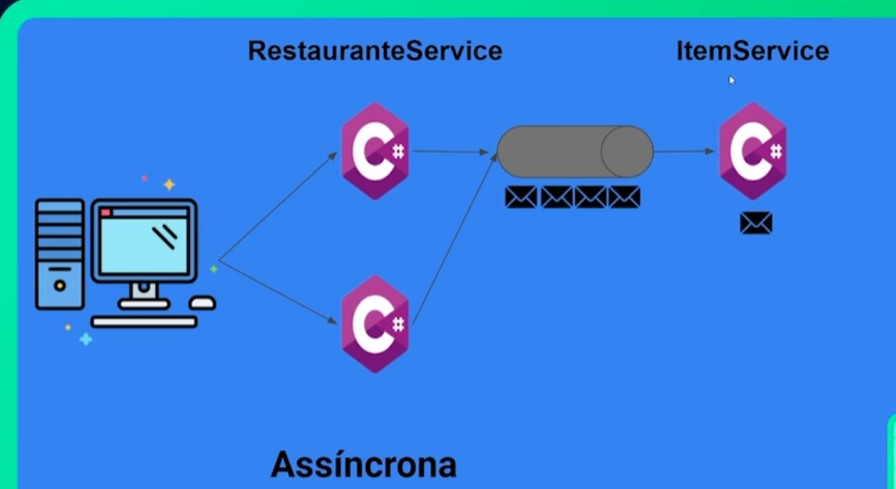

# Microservices with Dotnet, Docker and RabbitMQ

### Escope:
This project is developed to comunicate two microservices throught the asynchronous messages.

When is executed a POST in RestauranteService, it sends a message to a Rabbit Queue.

The ItemService has a Background service which listen this Queue and process the message when it is created.

### Requirements

- Docker

#### In the PowerShell run:

`docker pull mcr.microsoft.com/dotnet/sdk:6.0`

`docker pull mcr.microsoft.com/dotnet/aspnet:6.0`

`docker network create dotnet-microservices`

`docker build -t itemservice:1.2 ./ItemService`

`docker build -t restauranteservice:1.2 ./RestauranteService`

`docker run --name=mysql -e MYSQL_ROOT_PASSWORD=root -d --network dotnet-microservices mysql:5.6`

`docker run -it --rm --name rabbitmq -p 5672:5672 -d -p 15672:15672 --network dotnet-microservices rabbitmq:3.12-management`

`docker run -d -p 8080:80 --name item-service  --network dotnet-microservices  itemservice:1.2`

`docker run -d -p 8080:80 --name restaurante-service  --network dotnet-microservices  restauranteservice:1.2`

